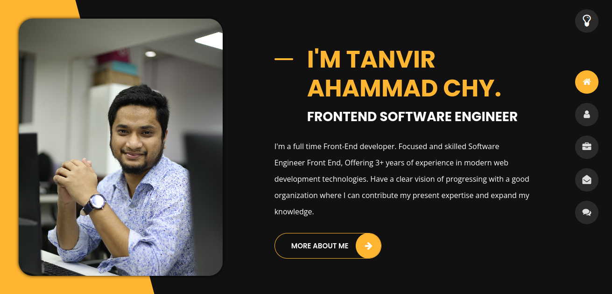

## Hi there my gorgeous friend 

I'm Tanvir, a full time Front-End developer from  Bangladesh. Focused and skilled Software Engineer Front End, Offering 3+ years of experience in modern web development technologies. Have a clear vision of progressing with a good organization where I can contribute my present expertise and expand my knowledge.

:coffee: &emsp;Connect with me!

    

:hearts: &emsp;I enjoy programming and sharing knowledge  
:computer: &emsp;Most used line of code `console.log("hello world")`  
🤔 &emsp;I’m looking for people who can help me to learn how to improve my programming skills.  
:e-mail: &emsp;How to reach me: tanvirchy.dev@gmail.com. 
⚡ &emsp;Fun fact: I'm highly interested on React JS and love it.

#### Things I code with

           

### Expertise On

   

### My Projects & Ventures

<table>
  <thead>
    <tr>
      <th align="center"><b>Projects</b></th>
      <th align="center"><b>Description</b></th>
      <th align="center"><b>Responses</b></th>
    </tr>
  </thead>
  <tbody>
    <tr>
      <td><a href="https://upd.life/"> Shareel </a></td>
      <td>I developed this application from scratch with an admin panel. I have implemented advanced features on this application like chat communication (socket.io), image cropping, Apex Chart, and booking time management, social app login and register. Technology used Nuxt, Vuex, Javascript, HTML, CSS, SCSS, custom library, Apex Charts etc.</td>
      <td>25k Active Users</td>
    </tr>
    <tr>
      <td><a href="https://www.lens.co.jp/" target="_blank">Lens</a></td>
      <td>I developed this application from scratch, implemented validation in both front-end and backend, and used Nuxt.js, JavaScript, and for state management by using Vuex.</td>
      <td>10K+ Active users</td>
    </tr>
    <tr>
      <td><a href="https://otsuki-dev.an.r.appspot.com/" target="_blank">Otsuki Dental</a></td>
      <td>Various API Integrations, pixel-perfect UI/UX implementation, MongoDB Queries, collecting and implementing business requirements. Technology used React, MUI Material, HTML, SCSS, React Redux. An advanced feature of this application was custom booking management and calendar.</td>
      <td>12k Active Users</td>
    </tr>
    <tr>
      <td><a href="https://honnetenshoku.com/" target="_blank">Honnetenshoku</a></td>
      <td>Implemented UX/UI design and integrated various types of APIs, optimized applications. Technology used React, JavaScript, HTML, CSS, SCSS, and React Redux.</td>
      <td>22k Active Users</td>
    </tr>
    <tr>
      <td><a href="https://e-resident.jp/" target="_blank">E-resident</a></td>
      <td>Implemented users panel and admin panel UX/UI design and integrated backend APIs. Its main feature is that search results are obtained by using surveys. For this application, using React.js, Axios, SCSS.</td>
      <td>17k Active Users</td>
    </tr>
    <tr>
      <td><a href="https://www.thejuiceconsultant.com/" target="_blank">Start Juice Bar</a></td>
      <td>I developed this application from scratch, implemented validation in both front-end and backend, and used Next.js, JavaScript, and TypeScript project. In this next project, I have used moduled-based SCSS and styles.</td>
      <td>2k Active Users</td>
    </tr>
  </tbody>
</table>

#### Profile Visits

  You wanna know more about me?

 

Focused and skilled Software Engineer Front End, Offering 3+ years of experience in modern web development technologies. Have a clear vision of progressing with a good organization where I can contribute my present expertise and expand my knowledge.

#### Do you have experience with any kind of JS framework ?

Yes, I have experience with React and Next.js for two years and Vue.js for 1.5 years.

